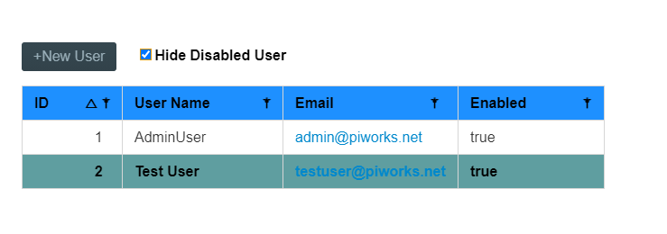
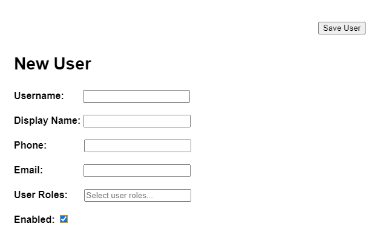
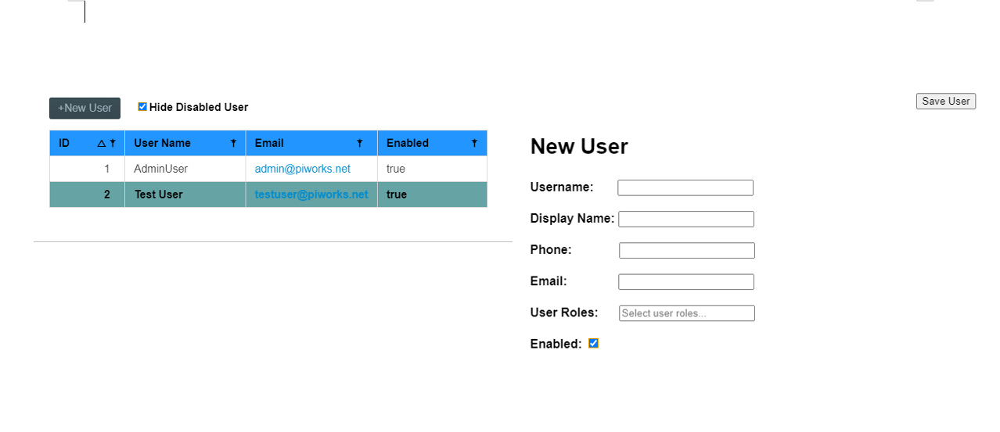

# P.I. Works UI Specification Document
---
Hello,
Before I start my documentation, I would like to enlighten you on that I have assumed this page is either a software page or an API endpoint to public/private users in which people access data from database. I am going to name this "Guest/Admin List Endpoint" for my documentation.

I would also like you to know that the linked pictures are the screenshots that I have taken on my preview case file. I have mixed markdown syntax with some html(for markdown) to create a similar looking table and page, however html codes were not compatible with GitHub.

---

## Guest/Admin Access Endpoint
In this endpoint, the user will be able to access the information about every users(user table) and create new users.

**What I will go over**
1. Home Page
    * Data Table
    * New User Button
    * Hide Disabled User Checkbox
2. New User Create

## 1.Home Page

When the page is first opened, users will first see the data table, one **+New User** button to create new users and a checkbox of **Hide Disabled User**. 

### Data Table

Starting with the data table, it consists of 4 columns which are named ID, User Name, Email and Enabled. Under each of these columns will be their related information about every user(Example: Under ID column, there will be user ID,an unique number which is different for every user). All of these informations will be mirrored to the table from our database. The column names will be left aligned while their interaction symbols will be right aligned. The background of the column names(first row) will be blue, while the text and interactables will be bold&black . Second row, where the first user should be, will have a white background, the texts on them will be regular&black. Third row will have a background color of dark cyan and the texts will be bold&black. Fourth row will be like second row, fifth will be like third and this will go on like this.

Only the ID column here will be interactable to order its related information by ascending or descending order. The interaction will be done by clicking on "ID" or the arrow(triangle) button. By default, when the table is loaded on the page first, it will be in descending order by users ID.

Though I can not give you any specific value about the width of the table, when the home page is loaded, the table should cover all the page and be visible enough. 

### New User Button
At the top left of the page there should be our first interactable button named **+New User**, the background color will be blue the text will be white. This button will pop a register interface which I will go into detail of, after I finish the explanation of the home page.

### Hide Disabled User Checkbox
The last interactable will be a checkbox named **Hide Disabled User**. This checkbox will be right next to the **+New User** button, and the checkbox name will be right of the checkbox. By default, the table will show all the users in the database whether they have their enabled true or false. If this checkbox is checked, the users, whose Enabled property is false, will not be shown on the table. If it is not checked, by default, all the users will be seen on the table.

At the end, the home page should look like this:

## 2.New User Page

New User Page will cover half of the page after **+New User** button is clicked. Its not gonna be a pop up window or its not gonna be on a different endpoint. The new user create screen will be right on the same page. It will, so to say, shrink the data table into half of its width. Before **+New User** button was clicked, the table used to cover all the page. Now, it will cover left half of the page, and the new user create page will cover the right half of the page. On this page, under "New User" header, there are 6 required area to be filled;

- Username
- Display name
- Phone
- Email
- User Roles
- Enabled

Each of username, display name, phone and email will have one wide empty box next to them in which user should write their inputs respectively.

 User roles will also have a wide box next to him in which writes "Select user roles...". When you click on the box, user will see a toogleable dropdown. This dropdown will have 3 options; Guest, Admin and Super Admin.

 Enabled will have a checkbox next to him, user can check or leave it unchecked.

After, New User Page appears on the screen, a new interactable button appears on the top right of the page. This button is named **Save User**, has a blue backgroud color and white text. When all the required fields mentioned above are filled, if this button is clicked, a new user will be created in the database. **Save User** button will be on the same horizontal line with **+New User** and **Hide Disabled User**. The New User will look something like this:

 

At the very end, the whole page should look something like this;

 

